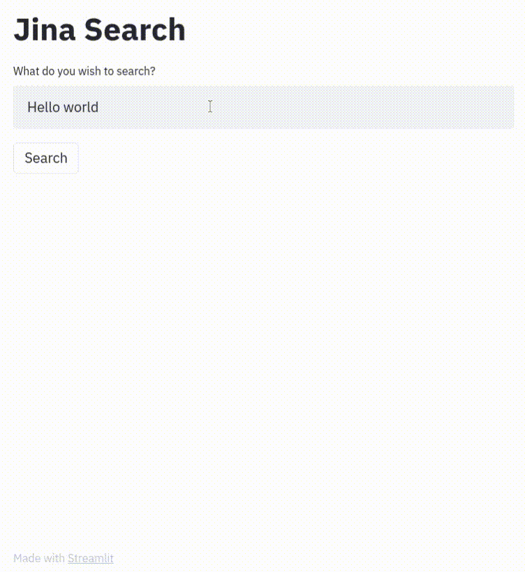
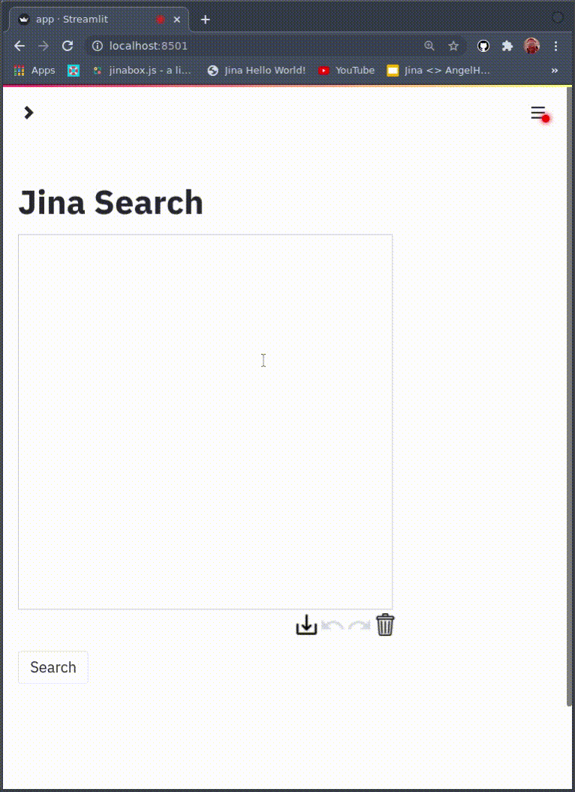

# Jina + Streamlit

Supports both text and image search

## 1. Clone repo, install requirements


```bash
git clone https://github.com/alexcg1/jina-streamlit-frontend.git
cd jina-streamlit-frontend.git
pip install -r requirements.txt
```

## 1. Run Docker Image

For text:

```bash
docker run -p 45678:45678 jinaai/hub.app.distilbert-southpark
```

For image:

```bash
docker run -p 65481:65481 -e "JINA_PORT=65481" jinaai/hub.app.bitsearch-pokedex search
```

## 3. Start up the front end

```bash
streamlit run app.py
```

## 4. Set endpoint

Use whatever Docker says is the right URL and port (in examples above, `45678` or `65481`)


## 5. Search!

### With Text



### With Image


### By Drawing


